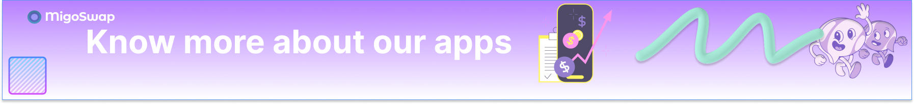

# App  Interface

<figure><figcaption></figcaption></figure>

Our App interface consists of the following contracts.

* Swap
* Liquidity Pool
* Yield Farming Pool
* Migo Pool

## _**Swap**_

Our Swap interface let users trade ECR20 crypto-assets. You can Instantly swap crypto tokens: no registration or account needed.

_To trade, visit our app page, then select the token to be swapped and the desired token then click on swap! The trading fee is 0.03%, some percentage goes to our liquidity providers, and some goes to MigoSwap Treasury which would be used for MIGO buyback and burn._ `(`_`Currently live on testnet)`_
