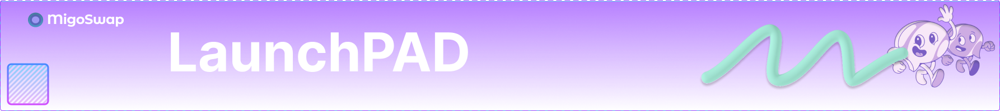

# LaunchPAD

<figure><figcaption></figcaption></figure>

Buy new tokens using CORE.

The project gets the CORE, MigoSwap burns the participation fees CORE. **You get the tokens.**

1. **You will need CORE** to participate.
2. **You will need CORE** to participate in Public Sales.
3. **You will need to meet certain requirements** to participate in Private Sales.

Learn [how to participate in IFO](broken-reference).

_Note: As we grow, MIGO will be the default token needed to participate in our private and public sale._
