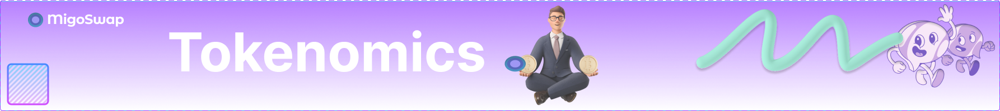

# Tokenomics

<figure><figcaption></figcaption></figure>

### Hello to all Amigos!

MIGO token will be a mint able token with and initial total Supply of  100,000,000 tokens. The distribution is as follows:

* Public Sale - 30%
* Initial Liquidity - 20%
* Airdrop - 10%
* Partnership & Ambassador - 5%
* Reserves - 15% (60% for team payment and marketing while the remainder will be locked).
* CEX Listing - 20%

<figure><figcaption>
Token Distribution
</figcaption></figure>
