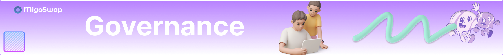

# Governance

<figure><figcaption></figcaption></figure>

MigoSwap will introduce a governance token model whereby MIGO holders, using three different smart contracts: MIGO Token Smart Contract, Governance Smart Contract and Time Lock Smart Contract. These smart contracts will allow the MigoSwap community to propose features, vote and execute approved proposals. Proposals include changes like adjusting Liquidity providers rewards, early withdrawal charge for MigoPool stakers, and other features that would be available in future time.
